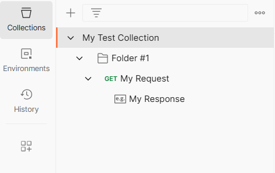
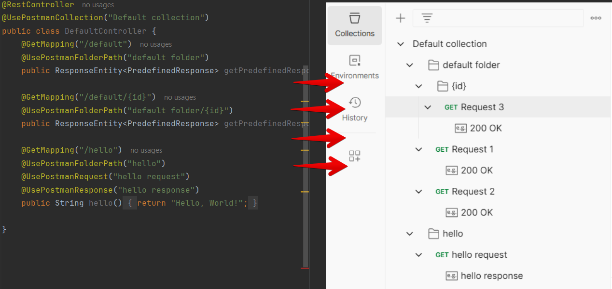

# Postman4j Interceptors

[](https://central.sonatype.com/artifact/dev.jora.postman4j/postman4j-models)
[](https://github.com/dyadyaJora/postman4j-interceptors/actions/workflows/gradle.yml)


This tool allows you to log your HTTP request chains in the form of a Postman collection, which can be easily reused in the Postman app.

Currently supported interceptors:

| For                 | Version | module                                                                                                    | postman4j                                                                                                                                                                             |
|---------------------|---------|-----------------------------------------------------------------------------------------------------------|---------------------------------------------------------------------------------------------------------------------------------------------------------------------------------------|
| Spring Boot         | 3.4.3   | [spring-interceptor](https://github.com/dyadyaJora/postman4j-interceptors/tree/master/spring-interceptor) | [](https://central.sonatype.com/artifact/dev.jora.postman4j/spring-interceptor) 
| Apache HttpClient 5 | 5.3.1   | [hc5-interceptor](https://github.com/dyadyaJora/postman4j-interceptors/tree/master/hc5-interceptor)                                                                                       | [](https://central.sonatype.com/artifact/dev.jora.postman4j/hc5-interceptor)       
| restassured         | 4.5.1   | [restassured-interceptor](https://github.com/dyadyaJora/postman4j-interceptors/tree/master/restassured-interceptor) | [](https://central.sonatype.com/artifact/dev.jora.postman4j/restassured-interceptor) |

## Overview

This project provides Java HTTP client instrumentation to log requests and responses as Postman collections, enabling quick reuse.
The library supports annotation-based configuration (such as `@UsePostmanCollection`, `@UsePostmanFolderPath`, `@UsePostmanRequest`, and `@UsePostmanResponse`) to seamlessly instrument Java methods for capturing HTTP interactions.
Simple demo application is available [here](https://github.com/dyadyaJora/demo-spring-postman-interceptor).

The project includes a module with Java classes for Postman collections, which can be used independently in the `postman4j-models` library.

In gradle
```gradle
implementation group: 'dev.jora.postman4j', name: 'postman4j-models', version: '0.0.4'
```

In maven
```xml
<dependency>
    <groupId>dev.jora.postman4j</groupId>
    <artifactId>postman4j-models</artifactId>
    <version>0.0.4</version>
</dependency>
```

Currently supported two interceptors: apache http client 5 as clientside integration and spring interceptor as serverside.

> Usage of the library with project reactor is not supported yet.

### Apache HttpClient Interceptor

#### Instllation

In gradle
```gradle
implementation group: 'dev.jora.postman4j', name: 'hc5-interceptor', version: '0.0.4'
```

In maven
```xml
<dependency>
    <groupId>dev.jora.postman4j</groupId>
    <artifactId>hc5-interceptor</artifactId>
    <version>0.0.4</version>
</dependency>
```

#### Usages

Example of instrumenting custom function in your java code

```java
@UsePostmanCollection("My Test Collection")
@UsePostmanFolderPath("Folder #1")
@UsePostmanRequest("My Request")
@UsePostmanResponse("My Response")
public static void executeRequest(CloseableHttpClient httpClient, HttpUriRequestBase request) throws IOException {
    try (CloseableHttpResponse response = httpClient.execute(request)) {
        System.out.println(response.getCode());
    }
}
```
Example of generated collection



### Spring Interceptor

#### Instllation

In gradle
```gradle
implementation group: 'dev.jora.postman4j', name: 'spring-interceptor', version: '0.0.4'
```

In maven
```xml
<dependency>
    <groupId>dev.jora.postman4j</groupId>
    <artifactId>spring-interceptor</artifactId>
    <version>0.0.4</version>
</dependency>
```

#### Usages

> for detailed spring-interceptor setup instruction see [demo-spring-postman-interceptor](https://github.com/dyadyaJora/demo-spring-postman-interceptor)

Example of instrumenting custom controller in your java code



Example of actuator endpoint output


## Settings

| Settings Name            | Allowed Values                                   | Description (Default Value)                                                             |
|--------------------------|--------------------------------------------------|-----------------------------------------------------------------------------------------|
| baseCollectionName       | `String`                                         | The default name of the collection (default: `Generated Collection`)                    |
| baseCollectionDescription| `String`                                         | The default description of the collection (default: `Generated Collection Description`) |
| schemaVersion            | `V2_1_0`                                         | The schema version of the collection (default: `V2_1_0`)                                |
| requestResponseMode      | `REQUEST_ONLY` \| `REQUEST_AND_RESPONSE`         | The mode of the request-response logging (default: `REQUEST_AND_RESPONSE`)              |
| enableRequestBody        | `boolean`                                        | Whether to log the request body (default: `true`)                                       |
| enableResponseBody       | `boolean`                                        | Whether to log the response body (default: `true`)                                      |
| logWhenChanged           | `boolean`                                        | Enable logging of current collection to stdout when changed (default: `true`)           |
| itemNamingStrategy       | `COUNTER`, `UUID`, `FROM_HEADER`                 | The naming strategy for the items (default: `COUNTER`)                                  |
| outputLocation           | `CONSOLE`, `FILE`, `BOTH`                        | **(not supported yet)** The output location for the collection (`CONSOLE`)              |
| selectedStatuses         | `List<Integer>`                                  | The selected statuses to save when filtering responses (default: `empty list`)          |
| selectedHeaders          | `List<String>`                                   | The selected headers to save when filtering responses (default: `empty list`)           |
| selectedExceptions       | `List<String>`                                   | The selected exceptions to save when filtering responses (default: `empty list`)        |
| headerName               | `String`                                         | The header name to use for the request name (default: `null`)                           |
| customStatusFilter       | `Predicate<Integer>`                             | The custom status filter function to use when filtering responses (default: `null`)     |
| foldingStrategy          | `NO_FOLDERS`, `ONE_FOLDER_PER_REQUEST`, `CUSTOM` | **(not supported yet)** The folding strategy to use when folding items (`NO_FOLDERS`)   |
| disableOnActuator        | `boolean`                                        | Whether to disable the interceptor when actuator endpoints are called (default: `true`)            |
